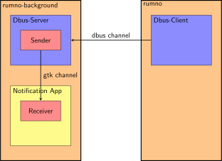

<div align="center"></div>

# Rumno
![Build status][pipeline]

[pipeline]: https://gitlab.com/natjo/rumno/badges/master/pipeline.svg

A lightweight Rust media notification manager to display volume, brightness and music information. Based on the idea of [volnoti](https://github.com/davidbrazdil/volnoti).
In order to achieve high efficiency and fast response times, Rumno is running a daemon in the background to create notifications. Communications are handled through a D-Bus interface.

## Required libraries
- Libdbus 1.6 or higher
- GTK+ 3.0

## How to build this project
Make sure the above mentioned requirements are installed on your computer.
Simply execute `build_and_install.sh` to build the program and install it on the system.
You can also look into the script for more details.

### How to build this project on Ubuntu:
```
sudo apt install libgtk-3-dev libdbus-1-dev rustc
git clone https://gitlab.com/natjo/rumno.git
cd rumno
cargo build --release
```
This will produce the two required binaries: `target/release/rumno` and `target/release/rumno-background`. How to interact with these is specified below. They can be used without any depenendencies. Move them where ever you want to use them.

## How to use Rumno
`rumno-background` must be started once and will run in the background as a daemon, creating the specified notifications using the gtk library.
Once the background process is running, the second binary, `rumno`, can be used to control the daemon to display the desired notifications.


Make sure `rumno-background` is running. To achieve this, simply start `rumno-background` in your `.xinitrc` or your window manager config file.
[mediactrl.sh](usage_samples/mediactrl.sh) is an example script displaying how to use Rumno together with volume, brightness and music control.


### Show volume notifications
Use the `-v` option to display any value between 0 and 100. The range can be set to any value with the cli option `--max-input-level`.
```
rumno -v 50
```
If overreach is turned on (it is by default), Rumno accepts values of up to twice the maximum values. An exceeding value will color the bar in another color.

You can also display a muted symbol.
```
rumno -m
```

### Show brightness notifications
Similar to volume levels, Rumno can display brightness levels.
```
rumno -b 50
```

### Show music control notifications
Rumno can display notifications for pausing and starting the spotify client as well as starting the next and the previous song :
```
rumno --pause
rumno --play
rumno --next
rumno -n
rumno --previous
rumno -p
```

### Show custom symbols
Rumno can display arbitrary symbols, too! Simply provide the path to your custom svg file as a parameter:
```
rumno --custom-symbol ~/images/smiley.svg
```

### Further settings
There is no config file in place yet, but a lot of features can be set through the command line on each run. You can find an exhaustive list using the `--help` parameter.
Here are some of the most relevant ones:

- `-t/--timeout` specifies the time a notification is displayed in seconds _[default: 1.5]_
- `-d/--dimensions` specifies the size of the displayed notification window in pixels _[default: 250 200]_
- `--background_color` specifies the background color of the displayed notification window as RGBA code _[default: 101010A0]_

If no bar is shown, the icon is centered, otherwise it is in the upper third

See `mediactrl.sh` as an example to use Rumno together with [pactl](https://linux.die.net/man/1/pactl), [xbacklight](https://www.x.org/archive/X11R7.5/doc/man/man1/xbacklight.1.html) and [spotify](https://wiki.archlinux.org/index.php/Spotify#D-Bus).

### How to stop the daemon process
If you like to stop the daemon, you can simply find its PID in the file `/tmp/rumno/rumno.pid`.
```
kill $(cat /tmp/rumno/rumno.pid)
```

## Behind the scenes
Basic schematic of how the program is structured.



## TODOs
* [ ] Add functionality to set position of notification on screen
* [ ] Add proper testing functionality
* [ ] Add an example systemd file to run `rumno-background` on startup
* [ ] Add feature to show current spotify song information

Credits
-------
- Based on [Volnoti](https://github.com/davidbrazdil/volnoti), basically a rewrite with additional functionality
- The amazing work of everyone involved in creating [rust bindings for gtk](https://github.com/gtk-rs)
- The project [resvg](https://github.com/RazrFalcon/resvg) for providing functionality to load svg files

